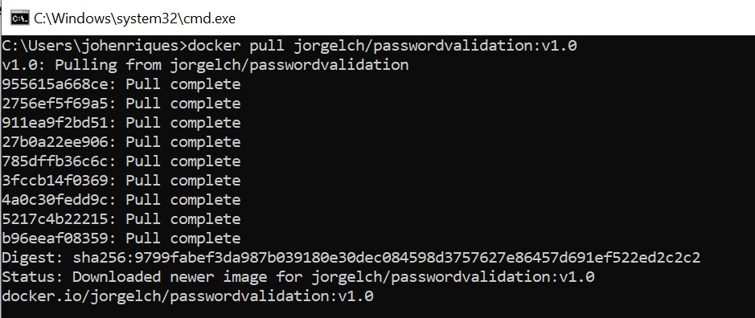
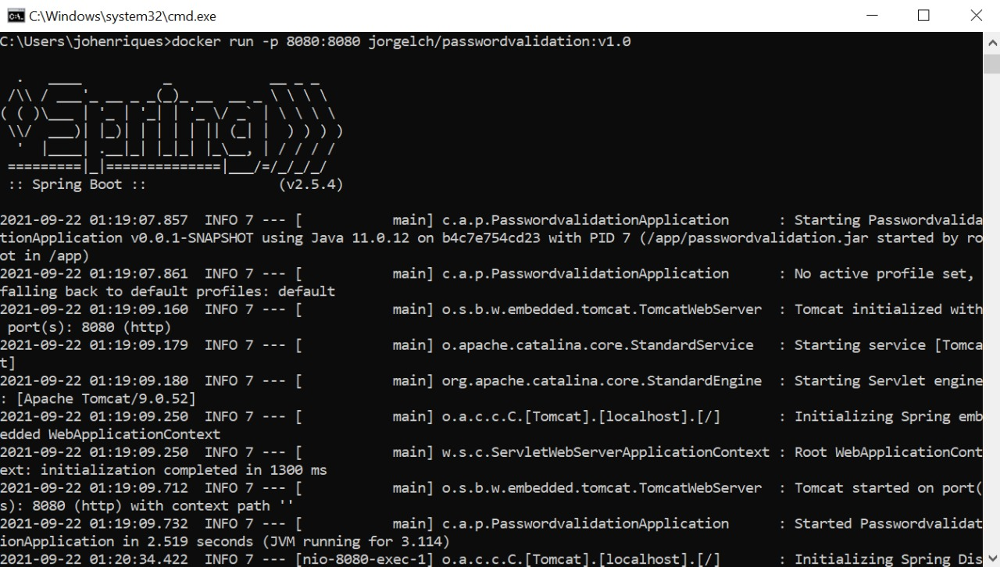
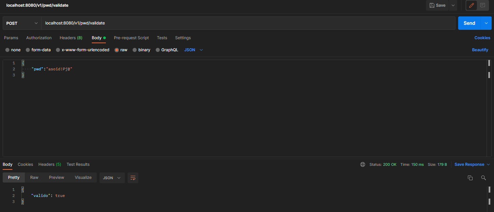
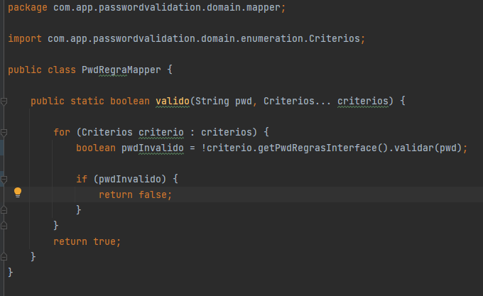

# passwordvalidation

API contruida para validação de senha fornecida pelo usuário. Será considerada uma senha válida aquela que seguir as regras abaixo.

## 📃 Regras

- Nove ou mais caracteres
- Ao menos 1 dígito
- Ao menos 1 letra minúscula
- Ao menos 1 letra maiúscula
- Ao menos 1 caractere especial
    - Considere como especial os seguintes caracteres: !@#$%^&*()-+
- Não possuir caracteres repetidos dentro do conjunto

Exemplos:

```c#
IsValid("") // false  
IsValid("aa") // false  
IsValid("ab") // false  
IsValid("AAAbbbCc") // false  
IsValid("AbTp9!foo") // false  
IsValid("AbTp9!foA") // false
IsValid("AbTp9 fok") // false
IsValid("AbTp9!fok") // true
```

## Requisitos

- [SDK Java 11]
- [Docker]


## Como executar aplicação

### Via Docker

- #### Baixando a imagem
    Para realizar o pull da imagem é necessario informar o seguinte comando no cmd `docker pull jorgelch/passwordvalidation:v1.0`.



- #### Executando imagem docker
    Apos baixar a imagem, é necessario executar a mesma subindo em um container onde a aplicação ficara disponivel para teste. Executar o seguinte comando: `docker run -p 8080:8080 jorgelch/passwordvalidation:v1.0`




## Testando

O seu uso é bem simples, ao iniciar a aplicação é exposta a URN `localhost:8080/v1/pwd/validate` utilizando o método HTTP POST.

Para realizar a requisição você deve passar o seguinte body (formato: application/JSON):
```
{
	"password":"1321123"
}
```

cURL:
```
curl --request POST \
  --url http://localhost:8080/v1/pwd/validate \
  --header 'Content-Type: application/json' \
  --data '{
	"password":"dfgdgfgfA74*"
}'
```



## Funcionamento

Todas as regras são definidas em um enum chamado `citerios` e cada critério retorna sua implementação da interface ``PwdRegrasInterfaces``, sendo possível validar a senha para varios criterios dando a possibilidade de implementar mais regas.




